<h1>Points to remember</h1>

## Looping Considerations
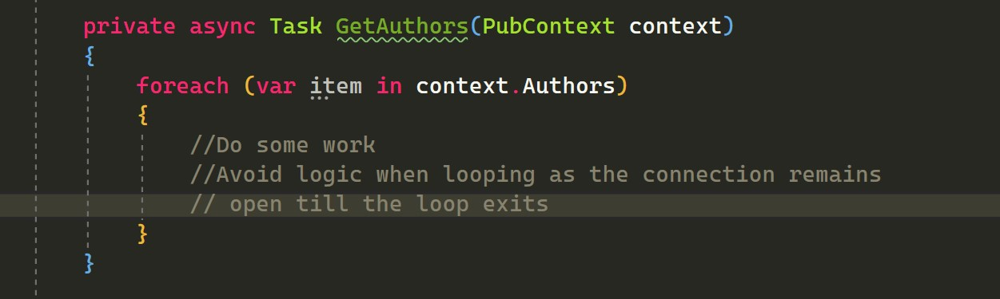
<p>The connection remains open as long as the loop completes, so try to execute the query before getting into the loop</p>

## Parameterize your Queries
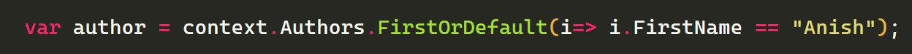
 Hard coded string will not be passed as parameters in the query sent to the database. So create variables and pass them
to the predicate.
This will generate a sql as follows

`Select Top 1 * from Authors where FirstName = 'Anish' `
#### Find will translate to select TOP(1)

## Updating Untracked objects
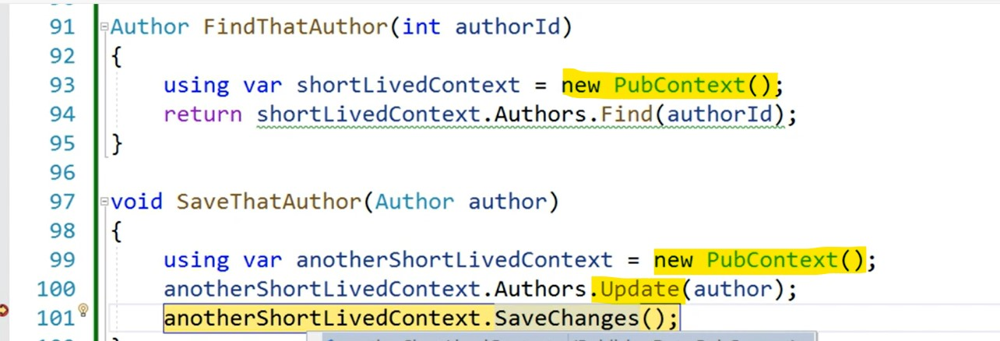
<p> In the above scenario, since the object is retrieved using a different DbContext instance, SaveChanges() doesnt know which property has exactly changed. So when we call Context.Update before SaveChanges(), the change tracker will set the state of all the properties as Modified, thus the Sql query will update all the properties on that object even if we change just one of its properties.  </p>
<p>
 If the object is being tracked by the Context, then its not needed to call Context.Update as the Context will internally call DetectChanges and update the EntityState before saving to the database. But if the object is untracked then its better to call the Add/Update/Remove methods on the context to let it know about the operation.
</p>

## AddRange Methods 
<p>If we send more than 3 records in the AddRange method then the objects are saved in a batch to the database (MERGE in sql). Since its faster to send a batch compared to executing several insert/update commands for each object.  </p>

## DBContext Facts
<p>The DBContext represents a session with the database and the session starts when we interact with the database and not when we create the DBContext.</p>
The DBContext tracks the state of an enitity using the below states
<ul>
 <li>Unchanged</li>
  <li>Added</li>
  <li>Modified</li>
  <li>Deleted</li>
</ul>
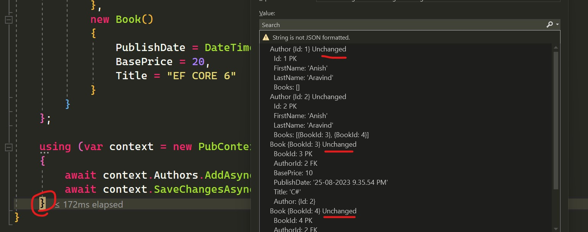
When we call SaveChanges(), EF Core looks at the state of each object and works with the provider to determine what time of operation needs to be executed on the database. Once SaveChanges() is executed, it resets the state of all the objects to unchanged. So if we call SaveChanges() again, nothing would change as the object that was acted upon has its state set to unchanged.

<i>SaveChanges() after an update will return the number of rows that were affected</i>
<p>DBContext calls DetectChanges() internally from the SaveChanges() to update the EntityState of each object. Its a public method and can be invoked from code</p>

After Calling DetectChanges the EntityState will be updated.
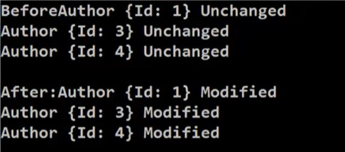

## Relations
If we need to save a book without an author (parent table), we can make the foriegn key property nullable
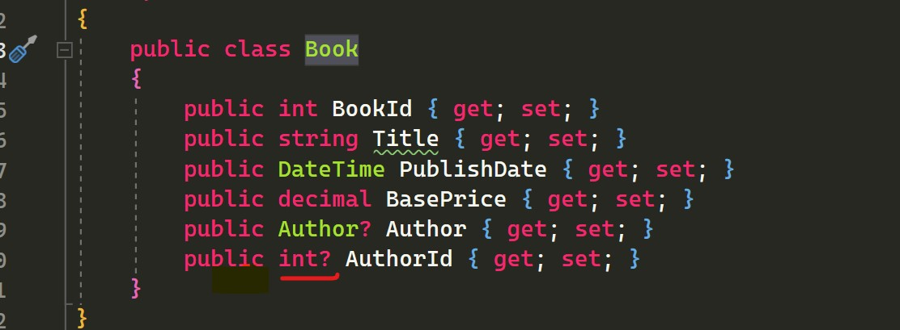

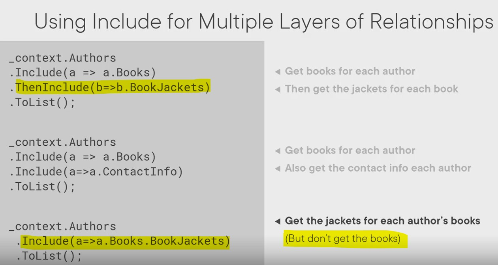
<p>How to use include to query navigation properties</p>

## Disconnected Updates
Here we try to query and update a record using different dbcontext instances.
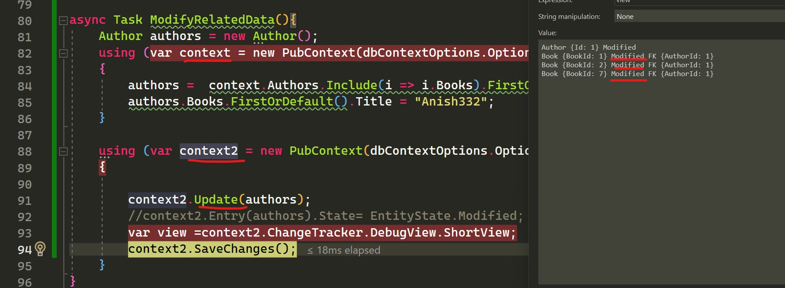
<p>In the above scenario, if we call update on the context then we set the state of all its data to modified and the generated sql will update all the rows.</p>
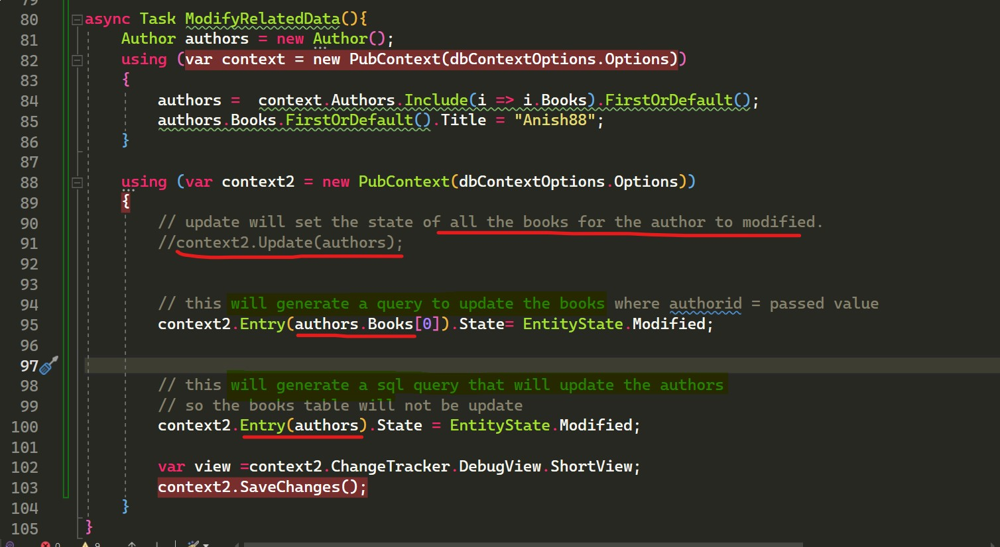

If we set the state property on the object using Entry method on the context
`context2.Entry(authors.Books[0]).State= EntityState.Modified; `
Then only that specific books gets updated or gets its status set to modified. 

`context2.Entry(authors).State= EntityState.Modified; `
<p> If we set the Entiry as the author, then the generated sql will try to update the authors object and not the books in it </p>


## Log the Generated Queries


## POINTS TO REMEMBER

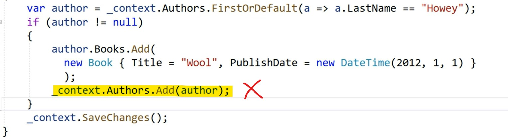
<p>In the above scenario, the author object is tracked by the context. So if we try to add it to the Context then an insert query will be generated, which will fail since the entity already
exists in the database. So be careful when dealing with tracked objects. We can make such silly mistakes.</p>

## Transaction Handling
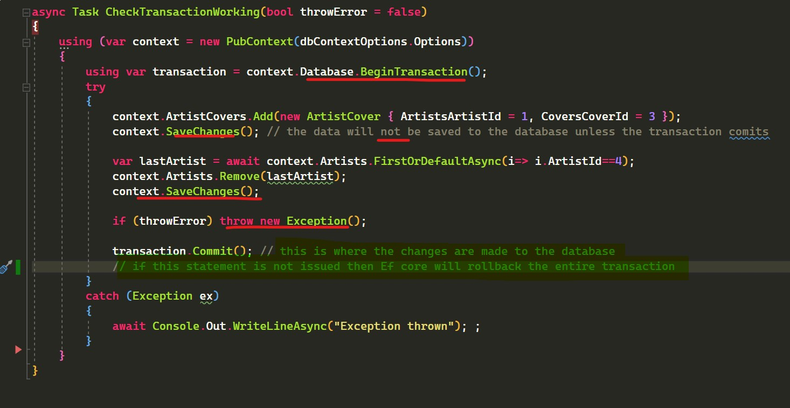

Even if we call SaveChanges() inside a transaction, the database will only be updated when the transaction is committed.

## Connection Pooling
<p>A DbContext is generally a light object: creating and disposing one doesn't involve a database operation, and most applications can do so without any noticeable impact on performance. However, each context instance does set up various internal services and objects necessary for performing its duties, and the overhead of continuously doing so may be significant in high-performance scenarios. For these cases, EF Core can pool your context instances: when you dispose your context, EF Core resets its state and stores it in an internal pool; when a new instance is next requested, that pooled instance is returned instead of setting up a new one. Context pooling allows you to pay context setup costs only once at program startup, rather than continuously.</p>
Connection pooling is upto the provider that is used by EF core, but there is a way to reuse the DBContext instances using the AddDbContextPool(). 

`builder.Services.AddDbContextPool<PubContext>
    (op => op.UseSqlServer(configuration.GetConnectionString("ConnectionStringKeyName")));`

So whenever an instance is needed, Ef core will check the pool before creating a new instance of the DbContext.

<a href='https://learn.microsoft.com/en-us/ef/core/performance/advanced-performance-topics?tabs=with-di%2Cexpression-api-with-constant'>Read more about connection pooling</a>
## Query caching and parameterization


## Compiled queries
<p>When EF receives a LINQ query tree for execution, it must first "compile" that tree, e.g. produce SQL from it. Because this task is a heavy process, EF caches queries by the query tree shape, so that queries with the same structure reuse internally-cached compilation outputs. This caching ensures that executing the same LINQ query multiple times is very fast, even if parameter values differ.

However, EF must still perform certain tasks before it can make use of the internal query cache. For example, your query's expression tree must be recursively compared with the expression trees of cached queries, to find the correct cached query. The overhead for this initial processing is negligible in the majority of EF applications, especially when compared to other costs associated with query execution (network I/O, actual query processing and disk I/O at the database...). However, in certain high-performance scenarios it may be desirable to eliminate it.</p>

```

public class AppDbContext : DbContext
{
    public DbSet<Product> Products { get; set; }

    // Compiled query definition
    private static readonly Func<AppDbContext, string, IQueryable<Product>> GetProductsByCategoryQuery = 
        EF.CompileQuery((AppDbContext context, string category) => 
            context.Products.Where(p => p.Category == category));

    // Usage of compiled query
    public IQueryable<Product> GetProductsByCategory(string category)
    {
        return GetProductsByCategoryQuery(this, category);
    }
}

```

<ul>
<li> DBContext calls DetectChanges() internally from the SaveChanges() to update the EntityState of each object. Its a public method and can be invoked from code </li>
<li> If we have multiple orderby's then LINQ qill ignore all but the last one so use ThenBy if we need multiple orderby's </li>
<li> DBContext.Add/Update will set the entity state to added or modified and then the context will persist these changes when
savechanges is called. In case of disconnected scenarios we need to explicity use these commands to set the entity state. </li>
<li>In connected scenarios we can directly call the savechanges method as the context will be tracking the changes and will
set the entity state for us.</li>
<li> use the DebugView on the ChangeTracker property on the context to find out how EF is tracking the entities.</li>
<li> DBSet.Add will set the entity state to added and Update will set the entity state to modified. So be carefull when updating data
as it will generate an insert statement in sql if we try to update an exisiting entity and add use the add method. </li>
<li> Where and OrderBy inside the include statement will be added to the sql query sent to the database</li>
<li> By default delete on cascade is turned on. SO inorder to not delete the related entities just set the foreign key to null</li>
</ul>
