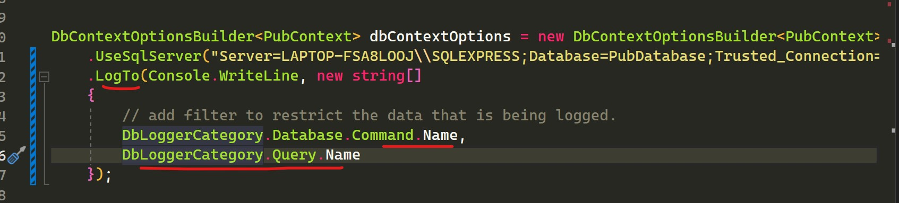

<h1>Points to remember</h1>

## Looping Considerations

The connection remains open as long as the loop completes, so try to execute the query before getting into the loop

## Parameterize your Queries

 Hard coded string will not be passed as parameters in the query sent to the database. So create variables and pass them
to the predicate.
This will generate a sql as follows

`Select Top 1 * from Authors where FirstName = 'Anish' `
#### Find will translate to select TOP(1)

## Updating Untracked objects

 In the above scenario, since the object is retrieved using a different DbContext instance, SaveChanges() doesnt know which property has exactly changed. So when we call Context.Update before SaveChanges(), the change tracker will set the state of all the properties as Modified, thus the Sql query will update all the properties on that object even if we change just one of its properties.  

 If the object is being tracked by the Context, then its not needed to call Context.Update as the Context will internally call DetectChanges and update the EntityState before saving to the database. But if the object is untracked then its better to call the Add/Update/Remove methods on the context to let it know about the operation.

## AddRange Methods 

If we send more than 3 records in the AddRange method then the objects are saved in a batch to the database (MERGE in sql). Since its faster to send a batch compared to executing several insert/update commands for each object.  

## DBContext Facts

The DBContext represents a session with the database and the session starts when we interact with the database and not when we create the DBContext.

The DBContext tracks the state of an enitity using the below states
<ul>
 <li>Unchanged</li>
  <li>Added</li>
  <li>Modified</li>
  <li>Deleted</li>
</ul>

When we call SaveChanges(), EF Core looks at the state of each object and works with the provider to determine what time of operation needs to be executed on the database. Once SaveChanges() is executed, it resets the state of all the objects to unchanged. So if we call SaveChanges() again, nothing would change as the object that was acted upon has its state set to unchanged.

<i>SaveChanges() after an update will return the number of rows that were affected</i>

DBContext calls DetectChanges() internally from the SaveChanges() to update the EntityState of each object. Its a public method and can be invoked from code

After Calling DetectChanges the EntityState will be updated.

## Relations
If we need to save a book without an author (parent table), we can make the foriegn key property nullable

## Log the Generated Queries

<ul>
<li> DBContext calls DetectChanges() internally from the SaveChanges() to update the EntityState of each object. Its a public method and can be invoked from code </li>
<li> If we have multiple orderby's then LINQ qill ignore all but the last one so use ThenBy if we need multiple orderby's </li>
<li> DBContext.Add/Update will set the entity state to added or modified and then the context will persist these changes when
savechanges is called. In case of disconnected scenarios we need to explicity use these commands to set the entity state. </li>
<li>In connected scenarios we can directly call the savechanges method as the context will be tracking the changes and will
set the entity state for us.</li>
<li> use the DebugView on the ChangeTracker property on the context to find out how EF is tracking the entities.</li>
<li> DBSet.Add will set the entity state to added and Update will set the entity state to modified. So be carefull when updating data
as it will generate an insert statement in sql if we try to update an exisiting entity and add use the add method. </li>
<li> Where and OrderBy inside the include statement will be added to the sql query sent to the database</li>
<li> By default delete on cascade is turned on. SO inorder to not delete the related entities just set the foreign key to null</li>
</ul>
